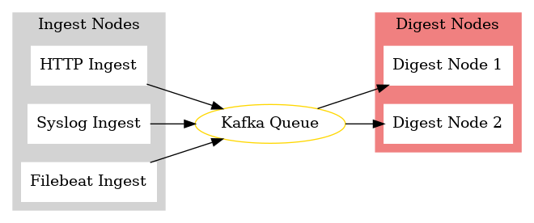

# Hummingbird
This is a toy log ingestion system built in Golang. You'll need Kafka set up to
get it running. There's a provided `docker-compose.yml` to make this easy.

Please note it is not for production use or is it complete in any way. The only
thing that is partially implemented thus far is the ingestion service.

# Running
Assuming you have Golang and Docker installed, from the root of the repo run:
```
$ docker-compose up -d
$ make all
$ bin/hummingbird_ingest # this starts the ingest node
```

## 🏛 Architecture

The `hummingbird` system is structured into a series of services that handle log ingestion, processing, and storage.

### Overview

The following is a visual representation of the system's components and their interactions:



### Components

1. **Ingest Nodes**:
   - **HTTP Ingest**: Accepts log data through an HTTP endpoints.
   - **Syslog Ingest**: Listens for syslog formatted log data.
   - **Filebeat Ingest**: Interfaces with Filebeat to collect logs.

2. **Kafka Queue**:
   - Serves as a reliable intermediate storage to decouple ingestion from processing. 
   This ensures that the system remains scalable and can handle large bursts of log data without degradation of service.

3. **Digest Nodes**:
   - Process and store the ingested log data. Each node can handle a segment of the data, allowing for distributed processing and storage.

### Flow

1. Logs are collected through various ingest nodes.
2. The collected logs are published to Kafka.
3. Digest nodes consume logs from Kafka, process them, and store them in segments on disk. 

## Why the name hummingbird?
Just as a hummingbird makes countless rapid moves to hover, computer systems 
execute numerous operations to function seamlessly. With `hummingbird`, we 
try to capture each essential flutter of your computer systems.
